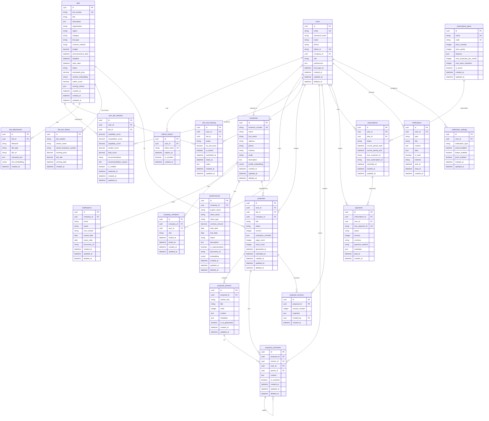

# ERD (엔티티 관계도)

## 개요

BidMaster의 데이터베이스 엔티티 관계도입니다. 11개 기능(F-01 ~ F-11)의 요구사항을 기반으로 설계되었습니다.

### 설계 원칙
- **PostgreSQL + pgvector** 활용
- **Soft Delete** 기본 적용 (`deleted_at` 컬럼)
- **감사 필드** 표준화 (`created_at`, `updated_at`)
- **UUID** 기본 키 사용 (분산 환경 대응)
- **임베딩 벡터** pgvector 타입 사용

---

## Mermaid ERD



---

## 테이블 상세

### 1. 사용자 및 인증

#### users
사용자 계정 정보를 저장합니다.

| 컬럼 | 타입 | 제약조건 | 설명 |
|------|------|----------|------|
| id | UUID | PK, DEFAULT gen_random_uuid() | 사용자 고유 ID |
| email | VARCHAR(255) | UK, NOT NULL | 이메일 (로그인 ID) |
| password_hash | VARCHAR(255) | | 비밀번호 해시 (소셜 로그인 시 NULL) |
| name | VARCHAR(100) | NOT NULL | 사용자 이름 |
| phone | VARCHAR(20) | | 전화번호 |
| kakao_id | VARCHAR(100) | UK | 카카오 사용자 ID |
| company_id | UUID | FK → companies.id | 소속 회사 ID |
| role | VARCHAR(20) | NOT NULL, DEFAULT 'member' | 역할 (owner, manager, member) |
| preferences | JSONB | DEFAULT '{}' | 사용자 설정 (알림, UI 등) |
| last_login_at | TIMESTAMP | | 최종 로그인 시간 |
| created_at | TIMESTAMP | NOT NULL, DEFAULT NOW() | 생성 시간 |
| updated_at | TIMESTAMP | NOT NULL, DEFAULT NOW() | 수정 시간 |
| deleted_at | TIMESTAMP | | 삭제 시간 (Soft Delete) |

#### refresh_tokens
JWT 리프레시 토큰을 관리합니다.

| 컬럼 | 타입 | 제약조건 | 설명 |
|------|------|----------|------|
| id | UUID | PK | 토큰 고유 ID |
| user_id | UUID | FK → users.id, NOT NULL | 사용자 ID |
| token_hash | VARCHAR(255) | UK, NOT NULL | 토큰 해시값 |
| expires_at | TIMESTAMP | NOT NULL | 만료 시간 |
| is_revoked | BOOLEAN | NOT NULL, DEFAULT FALSE | 폐기 여부 |
| created_at | TIMESTAMP | NOT NULL, DEFAULT NOW() | 생성 시간 |

---

### 2. 회사 프로필 (F-08)

#### companies
회사 기본 정보를 저장합니다.

| 컬럼 | 타입 | 제약조건 | 설명 |
|------|------|----------|------|
| id | UUID | PK | 회사 고유 ID |
| business_number | VARCHAR(10) | UK, NOT NULL | 사업자등록번호 |
| name | VARCHAR(200) | NOT NULL | 회사명 |
| ceo_name | VARCHAR(100) | | 대표자명 |
| address | VARCHAR(500) | | 주소 |
| phone | VARCHAR(20) | | 대표 전화번호 |
| industry | VARCHAR(100) | | 업종 |
| scale | VARCHAR(20) | | 기업 규모 (small, medium, large) |
| description | TEXT | | 회사 소개 |
| profile_embedding | vector(1536) | | 프로필 임베딩 (매칭용) |
| created_at | TIMESTAMP | NOT NULL | 생성 시간 |
| updated_at | TIMESTAMP | NOT NULL | 수정 시간 |
| deleted_at | TIMESTAMP | | 삭제 시간 |

#### company_members
회사-사용자 관계를 관리합니다.

| 컬럼 | 타입 | 제약조건 | 설명 |
|------|------|----------|------|
| id | UUID | PK | 멤버십 ID |
| company_id | UUID | FK → companies.id | 회사 ID |
| user_id | UUID | FK → users.id | 사용자 ID |
| role | VARCHAR(20) | NOT NULL | 역할 (owner, admin, member) |
| invited_at | TIMESTAMP | | 초대 시간 |
| joined_at | TIMESTAMP | | 가입 시간 |
| created_at | TIMESTAMP | NOT NULL | 생성 시간 |
| updated_at | TIMESTAMP | NOT NULL | 수정 시간 |

**Unique Constraint**: (company_id, user_id)

#### certifications
보유 인증 정보를 저장합니다.

| 컬럼 | 타입 | 제약조건 | 설명 |
|------|------|----------|------|
| id | UUID | PK | 인증 ID |
| company_id | UUID | FK → companies.id | 회사 ID |
| name | VARCHAR(200) | NOT NULL | 인증명 (GS인증, ISO 9001 등) |
| issuer | VARCHAR(200) | | 발급 기관 |
| cert_number | VARCHAR(100) | | 인증 번호 |
| issued_date | DATE | | 발급일 |
| expiry_date | DATE | | 만료일 |
| document_url | VARCHAR(500) | | 인증서 파일 URL |
| created_at | TIMESTAMP | NOT NULL | 생성 시간 |
| updated_at | TIMESTAMP | NOT NULL | 수정 시간 |
| deleted_at | TIMESTAMP | | 삭제 시간 |

#### performances
수행 실적을 저장합니다.

| 컬럼 | 타입 | 제약조건 | 설명 |
|------|------|----------|------|
| id | UUID | PK | 실적 ID |
| company_id | UUID | FK → companies.id | 회사 ID |
| project_name | VARCHAR(300) | NOT NULL | 사업명 |
| client_name | VARCHAR(200) | NOT NULL | 발주처명 |
| client_type | VARCHAR(50) | | 발주처 유형 (공공, 민간) |
| contract_amount | DECIMAL(15,0) | NOT NULL | 계약 금액 |
| start_date | DATE | NOT NULL | 착수일 |
| end_date | DATE | NOT NULL | 완료일 |
| status | VARCHAR(20) | NOT NULL | 상태 (completed, ongoing) |
| description | TEXT | | 사업 내용 |
| is_representative | BOOLEAN | DEFAULT FALSE | 대표 실적 여부 |
| document_url | VARCHAR(500) | | 실적증명서 URL |
| embedding | vector(1536) | | 실적 임베딩 (매칭용) |
| created_at | TIMESTAMP | NOT NULL | 생성 시간 |
| updated_at | TIMESTAMP | NOT NULL | 수정 시간 |
| deleted_at | TIMESTAMP | | 삭제 시간 |

---

### 3. 공고 및 매칭 (F-01, F-02, F-04)

#### bids
공공 입찰 공고 정보를 저장합니다.

| 컬럼 | 타입 | 제약조건 | 설명 |
|------|------|----------|------|
| id | UUID | PK | 공고 ID |
| bid_number | VARCHAR(50) | UK, NOT NULL | 공고번호 (나라장터) |
| title | VARCHAR(500) | NOT NULL | 공고명 |
| description | TEXT | | 공고 요약 |
| organization | VARCHAR(200) | NOT NULL | 발주기관 |
| region | VARCHAR(100) | | 지역 |
| category | VARCHAR(100) | | 수요기관 분류 |
| bid_type | VARCHAR(50) | | 입찰 유형 (일반, 제한, 지명) |
| contract_method | VARCHAR(50) | | 계약 방식 (적격심사, 최저가, 혼합) |
| budget | DECIMAL(15,0) | | 추정가격 |
| announcement_date | DATE | | 공고일 |
| deadline | TIMESTAMP | NOT NULL | 마감일시 |
| open_date | TIMESTAMP | | 개찰일시 |
| status | VARCHAR(20) | NOT NULL | 상태 (open, closed, awarded, cancelled) |
| estimated_price | DECIMAL(15,0) | | 사전공고 추정가격 |
| content_embedding | vector(1536) | | 공고 내용 임베딩 |
| match_score | DECIMAL(5,2) | | 전체 매칭 점수 |
| scoring_criteria | JSONB | | 평가 기준 (파싱된 데이터) |
| crawled_at | TIMESTAMP | | 크롤링 시간 |
| created_at | TIMESTAMP | NOT NULL | 생성 시간 |
| updated_at | TIMESTAMP | NOT NULL | 수정 시간 |

#### bid_attachments
공고 첨부파일 정보를 저장합니다.

| 컬럼 | 타입 | 제약조건 | 설명 |
|------|------|----------|------|
| id | UUID | PK | 첨부파일 ID |
| bid_id | UUID | FK → bids.id | 공고 ID |
| filename | VARCHAR(500) | NOT NULL | 파일명 |
| file_type | VARCHAR(50) | NOT NULL | 파일 타입 (PDF, HWP, DOC) |
| file_url | VARCHAR(1000) | NOT NULL | 파일 URL |
| extracted_text | TEXT | | 추출된 텍스트 |
| text_embedding | vector(1536) | | 텍스트 임베딩 |
| created_at | TIMESTAMP | NOT NULL | 생성 시간 |

#### bid_win_history
과거 낙찰 이력을 저장합니다.

| 컬럼 | 타입 | 제약조건 | 설명 |
|------|------|----------|------|
| id | UUID | PK | 이력 ID |
| bid_number | VARCHAR(50) | NOT NULL | 공고번호 |
| winner_name | VARCHAR(200) | NOT NULL | 낙찰자명 |
| winner_business_number | VARCHAR(10) | | 낙찰자 사업자번호 |
| winning_price | DECIMAL(15,0) | NOT NULL | 낙찰 금액 |
| bid_rate | DECIMAL(5,4) | | 낙찰율 (낙찰가/추정가) |
| winning_date | DATE | | 낙찰일 |
| created_at | TIMESTAMP | NOT NULL | 생성 시간 |

**Index**: bid_number, winner_business_number

#### user_bid_matches
사용자별 공고 매칭 분석 결과를 저장합니다.

| 컬럼 | 타입 | 제약조건 | 설명 |
|------|------|----------|------|
| id | UUID | PK | 매칭 ID |
| user_id | UUID | FK → users.id | 사용자 ID |
| bid_id | UUID | FK → bids.id | 공고 ID |
| suitability_score | DECIMAL(5,2) | | 적합도 점수 |
| competition_score | DECIMAL(5,2) | | 경쟁 강도 점수 |
| capability_score | DECIMAL(5,2) | | 역량 점수 |
| market_score | DECIMAL(5,2) | | 시장 환경 점수 |
| total_score | DECIMAL(5,2) | NOT NULL | 종합 점수 (0~100) |
| recommendation | VARCHAR(20) | | 추천 여부 (recommended, neutral, not_recommended) |
| recommendation_reason | TEXT | | AI 추천 사유 |
| is_notified | BOOLEAN | DEFAULT FALSE | 알림 발송 여부 |
| analyzed_at | TIMESTAMP | | 분석 시간 |
| created_at | TIMESTAMP | NOT NULL | 생성 시간 |
| updated_at | TIMESTAMP | NOT NULL | 수정 시간 |

**Unique Constraint**: (user_id, bid_id)

#### user_bid_tracking
사용자의 입찰 참여 현황을 추적합니다.

| 컬럼 | 타입 | 제약조건 | 설명 |
|------|------|----------|------|
| id | UUID | PK | 추적 ID |
| user_id | UUID | FK → users.id | 사용자 ID |
| bid_id | UUID | FK → bids.id | 공고 ID |
| status | VARCHAR(20) | NOT NULL | 상태 (interested, participating, submitted, won, lost) |
| my_bid_price | DECIMAL(15,0) | | 나의 투찰 금액 |
| is_winner | BOOLEAN | | 낙찰 여부 |
| submitted_at | TIMESTAMP | | 제출 시간 |
| result_at | TIMESTAMP | | 결과 확인 시간 |
| notes | TEXT | | 메모 |
| created_at | TIMESTAMP | NOT NULL | 생성 시간 |
| updated_at | TIMESTAMP | NOT NULL | 수정 시간 |

**Unique Constraint**: (user_id, bid_id)

---

### 4. 제안서 (F-03, F-05)

#### proposals
제안서 메타 정보를 저장합니다.

| 컬럼 | 타입 | 제약조건 | 설명 |
|------|------|----------|------|
| id | UUID | PK | 제안서 ID |
| user_id | UUID | FK → users.id | 작성자 ID |
| bid_id | UUID | FK → bids.id | 공고 ID |
| company_id | UUID | FK → companies.id | 회사 ID |
| title | VARCHAR(300) | NOT NULL | 제안서 제목 |
| status | VARCHAR(20) | NOT NULL | 상태 (draft, generating, ready, submitted) |
| version | INTEGER | NOT NULL, DEFAULT 1 | 버전 번호 |
| evaluation_checklist | JSONB | | 평가 항목 체크리스트 |
| page_count | INTEGER | DEFAULT 0 | 페이지 수 |
| word_count | INTEGER | DEFAULT 0 | 글자 수 |
| generated_at | TIMESTAMP | | AI 생성 완료 시간 |
| submitted_at | TIMESTAMP | | 제출 시간 |
| created_at | TIMESTAMP | NOT NULL | 생성 시간 |
| updated_at | TIMESTAMP | NOT NULL | 수정 시간 |
| deleted_at | TIMESTAMP | | 삭제 시간 |

#### proposal_sections
제안서 섹션 내용을 저장합니다.

| 컬럼 | 타입 | 제약조건 | 설명 |
|------|------|----------|------|
| id | UUID | PK | 섹션 ID |
| proposal_id | UUID | FK → proposals.id | 제안서 ID |
| section_key | VARCHAR(50) | NOT NULL | 섹션 키 (overview, methodology, schedule, etc.) |
| title | VARCHAR(200) | NOT NULL | 섹션 제목 |
| order | INTEGER | NOT NULL | 순서 |
| content | TEXT | | 섹션 내용 (HTML) |
| metadata | JSONB | | 섹션 메타데이터 |
| is_ai_generated | BOOLEAN | DEFAULT TRUE | AI 생성 여부 |
| created_at | TIMESTAMP | NOT NULL | 생성 시간 |
| updated_at | TIMESTAMP | NOT NULL | 수정 시간 |

**Unique Constraint**: (proposal_id, section_key)

#### proposal_comments
제안서 협업 댓글을 저장합니다.

| 컬럼 | 타입 | 제약조건 | 설명 |
|------|------|----------|------|
| id | UUID | PK | 댓글 ID |
| proposal_id | UUID | FK → proposals.id | 제안서 ID |
| section_id | UUID | FK → proposal_sections.id | 섹션 ID (NULL: 전체) |
| user_id | UUID | FK → users.id | 작성자 ID |
| parent_id | UUID | FK → proposal_comments.id | 부모 댓글 ID |
| content | TEXT | NOT NULL | 댓글 내용 |
| is_resolved | BOOLEAN | DEFAULT FALSE | 해결 여부 |
| created_at | TIMESTAMP | NOT NULL | 생성 시간 |
| updated_at | TIMESTAMP | NOT NULL | 수정 시간 |
| deleted_at | TIMESTAMP | | 삭제 시간 |

#### proposal_versions
제안서 버전 히스토리를 저장합니다.

| 컬럼 | 타입 | 제약조건 | 설명 |
|------|------|----------|------|
| id | UUID | PK | 버전 ID |
| proposal_id | UUID | FK → proposals.id | 제안서 ID |
| version_number | INTEGER | NOT NULL | 버전 번호 |
| snapshot | JSONB | NOT NULL | 스냅샷 (전체 섹션) |
| created_by | UUID | FK → users.id | 생성자 ID |
| created_at | TIMESTAMP | NOT NULL | 생성 시간 |

---

### 5. 결제 및 구독 (F-09)

#### subscription_plans
구독 플랜 정보를 저장합니다.

| 컬럼 | 타입 | 제약조건 | 설명 |
|------|------|----------|------|
| id | UUID | PK | 플랜 ID |
| name | VARCHAR(100) | UK, NOT NULL | 플랜명 |
| code | VARCHAR(50) | UK, NOT NULL | 플랜 코드 (free, pro, enterprise) |
| price_monthly | INTEGER | NOT NULL | 월 요금 (원) |
| price_yearly | INTEGER | NOT NULL | 연 요금 (원) |
| features | JSONB | NOT NULL | 포함 기능 |
| max_proposals_per_month | INTEGER | NOT NULL | 월 제안서 생성 한도 |
| max_team_members | INTEGER | NOT NULL | 팀원 수 한도 |
| is_active | BOOLEAN | DEFAULT TRUE | 활성화 여부 |
| created_at | TIMESTAMP | NOT NULL | 생성 시간 |
| updated_at | TIMESTAMP | NOT NULL | 수정 시간 |

#### subscriptions
사용자 구독 정보를 저장합니다.

| 컬럼 | 타입 | 제약조건 | 설명 |
|------|------|----------|------|
| id | UUID | PK | 구독 ID |
| user_id | UUID | FK → users.id | 사용자 ID |
| plan_id | UUID | FK → subscription_plans.id | 플랜 ID |
| status | VARCHAR(20) | NOT NULL | 상태 (active, past_due, cancelled, expired) |
| current_period_start | TIMESTAMP | NOT NULL | 현재 기간 시작일 |
| current_period_end | TIMESTAMP | NOT NULL | 현재 기간 종료일 |
| toss_customer_id | VARCHAR(100) | | 토스 고객 ID |
| toss_subscription_id | VARCHAR(100) | | 토스 구독 ID |
| cancelled_at | TIMESTAMP | | 취소 시간 |
| created_at | TIMESTAMP | NOT NULL | 생성 시간 |
| updated_at | TIMESTAMP | NOT NULL | 수정 시간 |

#### payments
결제 내역을 저장합니다.

| 컬럼 | 타입 | 제약조건 | 설명 |
|------|------|----------|------|
| id | UUID | PK | 결제 ID |
| subscription_id | UUID | FK → subscriptions.id | 구독 ID |
| user_id | UUID | FK → users.id | 사용자 ID |
| toss_payment_id | VARCHAR(100) | UK | 토스 결제 ID |
| status | VARCHAR(20) | NOT NULL | 상태 (pending, completed, failed, cancelled) |
| amount | INTEGER | NOT NULL | 결제 금액 (원) |
| currency | VARCHAR(3) | DEFAULT 'KRW' | 통화 |
| payment_method | VARCHAR(50) | | 결제 수단 |
| metadata | JSONB | | 추가 정보 |
| paid_at | TIMESTAMP | | 결제 완료 시간 |
| created_at | TIMESTAMP | NOT NULL | 생성 시간 |

---

### 6. 알림 (F-10)

#### notifications
알림 메시지를 저장합니다.

| 컬럼 | 타입 | 제약조건 | 설명 |
|------|------|----------|------|
| id | UUID | PK | 알림 ID |
| user_id | UUID | FK → users.id | 수신자 ID |
| type | VARCHAR(50) | NOT NULL | 알림 유형 (bid_matched, deadline, proposal_ready, etc.) |
| title | VARCHAR(200) | NOT NULL | 알림 제목 |
| content | TEXT | NOT NULL | 알림 내용 |
| data | JSONB | | 관련 데이터 (bid_id, proposal_id 등) |
| is_read | BOOLEAN | DEFAULT FALSE | 읽음 여부 |
| channel | VARCHAR(20) | | 발송 채널 (email, kakao, push) |
| sent_at | TIMESTAMP | | 발송 시간 |
| read_at | TIMESTAMP | | 읽음 시간 |
| created_at | TIMESTAMP | NOT NULL | 생성 시간 |

#### notification_settings
사용자별 알림 설정을 저장합니다.

| 컬럼 | 타입 | 제약조건 | 설명 |
|------|------|----------|------|
| id | UUID | PK | 설정 ID |
| user_id | UUID | FK → users.id | 사용자 ID |
| notification_type | VARCHAR(50) | NOT NULL | 알림 유형 |
| email_enabled | BOOLEAN | DEFAULT TRUE | 이메일 수신 여부 |
| kakao_enabled | BOOLEAN | DEFAULT TRUE | 카카오 알림톡 수신 여부 |
| push_enabled | BOOLEAN | DEFAULT TRUE | 푸시 알림 수신 여부 |
| created_at | TIMESTAMP | NOT NULL | 생성 시간 |
| updated_at | TIMESTAMP | NOT NULL | 수정 시간 |

**Unique Constraint**: (user_id, notification_type)

---

## 인덱스 전략

### Primary Indexes (자동 생성)
- 모든 PK 컬럼에 B-Tree 인덱스

### Performance Indexes

```sql
-- 사용자 조회
CREATE INDEX idx_users_email ON users(email) WHERE deleted_at IS NULL;
CREATE INDEX idx_users_kakao_id ON users(kakao_id) WHERE kakao_id IS NOT NULL;

-- 회사 조회
CREATE INDEX idx_companies_business_number ON companies(business_number) WHERE deleted_at IS NULL;

-- 공고 검색
CREATE INDEX idx_bids_bid_number ON bids(bid_number);
CREATE INDEX idx_bids_status ON bids(status);
CREATE INDEX idx_bids_deadline ON bids(deadline);
CREATE INDEX idx_bids_organization ON bids(organization);
CREATE INDEX idx_bids_category ON bids(category);

-- 공고 임베딩 검색 (IVFFlat)
CREATE INDEX idx_bids_content_embedding ON bids
    USING ivfflat (content_embedding vector_cosine_ops)
    WITH (lists = 100);

-- 수행 실적 임베딩 검색
CREATE INDEX idx_performances_embedding ON performances
    USING ivfflat (embedding vector_cosine_ops)
    WITH (lists = 100);

-- 회사 프로필 임베딩 검색
CREATE INDEX idx_companies_profile_embedding ON companies
    USING ivfflat (profile_embedding vector_cosine_ops)
    WITH (lists = 100);

-- 매칭 점수 조회
CREATE INDEX idx_user_bid_matches_user_score ON user_bid_matches(user_id, total_score DESC);
CREATE INDEX idx_user_bid_matches_bid ON user_bid_matches(bid_id);

-- 제안서 조회
CREATE INDEX idx_proposals_user ON proposals(user_id) WHERE deleted_at IS NULL;
CREATE INDEX idx_proposals_bid ON proposals(bid_id) WHERE deleted_at IS NULL;
CREATE INDEX idx_proposals_status ON proposals(status) WHERE deleted_at IS NULL;

-- 알림 조회
CREATE INDEX idx_notifications_user_unread ON notifications(user_id, is_read) WHERE is_read = FALSE;
CREATE INDEX idx_notifications_user_created ON notifications(user_id, created_at DESC);

-- 낙찰 이력 분석
CREATE INDEX idx_bid_win_history_bid_number ON bid_win_history(bid_number);
CREATE INDEX idx_bid_win_history_winner ON bid_win_history(winner_business_number);
CREATE INDEX idx_bid_win_history_date ON bid_win_history(winning_date);

-- 구독 상태
CREATE INDEX idx_subscriptions_user_active ON subscriptions(user_id) WHERE status = 'active';
CREATE INDEX idx_subscriptions_period_end ON subscriptions(current_period_end);

-- 토큰 관리
CREATE INDEX idx_refresh_tokens_user ON refresh_tokens(user_id) WHERE is_revoked = FALSE;
CREATE INDEX idx_refresh_tokens_expires ON refresh_tokens(expires_at);
```

---

## pgvector 활용

### 임베딩 모델
- **모델**: OpenAI `text-embedding-3-small` (1536차원)
- **대체**: 로컬 모델 (sentence-transformers) 고려

### 임베딩 대상

| 테이블 | 컬럼 | 용도 |
|--------|------|------|
| companies | profile_embedding | 회사-공고 매칭 |
| performances | embedding | 실적-공고 매칭 |
| bids | content_embedding | 유사 공고 검색 |
| bid_attachments | text_embedding | 첨부파일 내용 검색 |

### 벡터 검색 예시

```sql
-- 유사 공고 검색 (코사인 유사도)
SELECT id, title,
       1 - (content_embedding <=> query_vector) as similarity
FROM bids
WHERE deleted_at IS NULL
ORDER BY content_embedding <=> query_vector
LIMIT 10;

-- 회사-공고 매칭 점수 계산
SELECT b.id, b.title,
       1 - (b.content_embedding <=> c.profile_embedding) as match_score
FROM bids b
CROSS JOIN companies c
WHERE c.id = :company_id
ORDER BY match_score DESC
LIMIT 20;
```

---

## 데이터 무결성 제약조건

### Foreign Key Constraints
```sql
-- CASCADE DELETE 방지, SET NULL 또는 RESTRICT 사용
ALTER TABLE proposals
    ADD CONSTRAINT fk_proposals_user
    FOREIGN KEY (user_id) REFERENCES users(id) ON DELETE RESTRICT;

ALTER TABLE proposals
    ADD CONSTRAINT fk_proposals_company
    FOREIGN KEY (company_id) REFERENCES companies(id) ON DELETE SET NULL;
```

### Check Constraints
```sql
-- 점수 범위 검증
ALTER TABLE user_bid_matches
    ADD CONSTRAINT chk_score_range
    CHECK (total_score >= 0 AND total_score <= 100);

-- 구독 기간 검증
ALTER TABLE subscriptions
    ADD CONSTRAINT chk_period_range
    CHECK (current_period_end > current_period_start);

-- 낙찰율 범위 검증
ALTER TABLE bid_win_history
    ADD CONSTRAINT chk_bid_rate_range
    CHECK (bid_rate >= 0 AND bid_rate <= 2);
```

---

## 변경 이력

| 날짜 | 변경 내용 | 이유 |
|------|----------|------|
| 2026-03-01 | 초기 ERD 설계 | 프로젝트 착수 |
