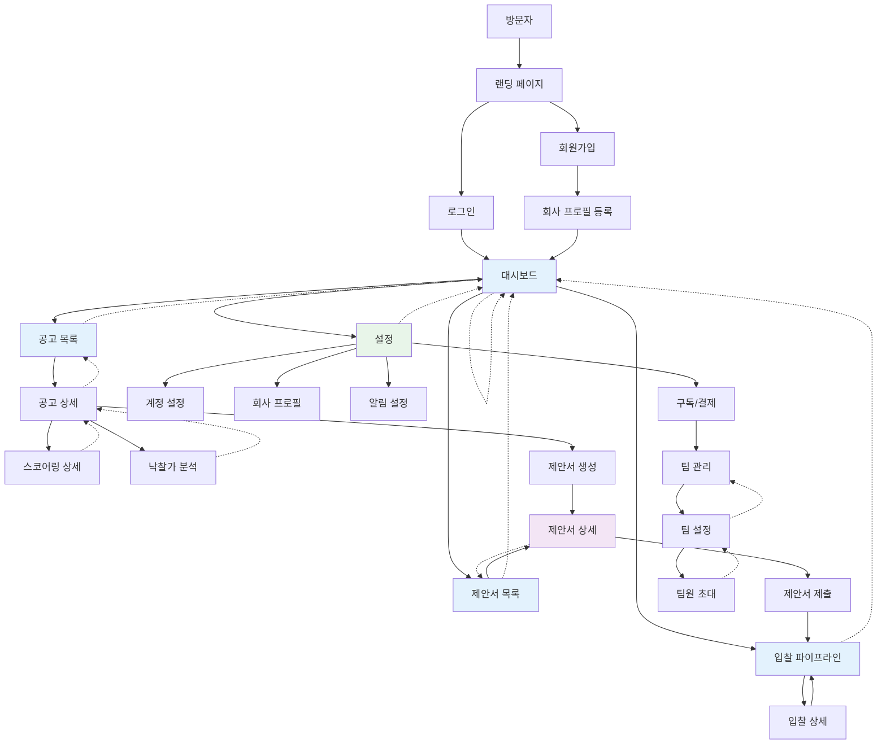

# 내비게이션 구조

## 1. 개요

BidMaster는 AI 기반 공공 입찰 제안서 자동화 SaaS로, 나라장터 공고 수집부터 제안서 작성, 입찰 관리까지 전체 프로세스를 지원합니다.

### 사용자 경험 원칙
- **공고 중심 흐름**: 공고 발견 → 스코어링 → 제안서 생성 → 제출 순서로 자연스러운 유도
- **빠른 접근**: 대시보드에서 중요한 정보 한눈에 확인 후 깊이 있는 분석으로 이동
- **권한 기반 가이드**: 미로그인/무료 플랜 사용자에게는 기능 노출/안내 후 업셀 유도

### 라우팅 전략 (Next.js 14 App Router)
- 그룹 레이아웃 활용: `(auth)`, `(main)`, `(dashboard)`
- 동적 라우트: 공고 ID, 제안서 ID 기반 상세 페이지
- 인증 가드: 미들웨어에서 경로별 인증 여부 검증

---

## 2. 화면 목록

| 화면명 | URL | 설명 | 인증 필요 |
|--------|-----|------|----------|
| **공용 페이지** |
| 랜딩 페이지 | `/` | 서비스 소개, 가격, FAQ | ❌ |
| 로그인 | `/login` | 이메일/비밀번호, 카카오 로그인 | ❌ |
| 회원가입 | `/register` | 이메일/비밀번호 회원가입 | ❌ |
| 비밀번호 찾기 | `/forgot-password` | 비밀번호 재설정 이메일 발송 | ❌ |
| 비밀번호 재설정 | `/reset-password/[token]` | 비밀번호 변경 폼 | ❌ |
| 이용약관 | `/terms` | 서비스 이용약관 | ❌ |
| 개인정보처리방침 | `/privacy` | 개인정보처리방침 | ❌ |
| **대시보드** |
| 대시보드 홈 | `/dashboard` | KPI 카드, 파이프라인, 마감 임박 공고 | ⭕ |
| **공고 관리** |
| 공고 목록 | `/bids` | 전체 공고, 필터, 매칭 점수 표시 | ⭕ |
| 공고 상세 | `/bids/[bidId]` | 공고 요약, 첨부파일, 스코어링 결과 | ⭕ |
| 스코어링 상세 | `/bids/[bidId]/score` | 낙찰 가능성 분석 상세 | ⭕ |
| 낙찰가 분석 | `/bids/[bidId]/price-prediction` | 낙찰가 분석, 투찰 전략 | ⭕ |
| **제안서 관리** |
| 제안서 목록 | `/proposals` | 전체 제안서, 상태별 필터 | ⭕ |
| 제안서 상세 | `/proposals/[proposalId]` | 제안서 편집기, AI 어시스턴트 | ⭕ |
| 제안서 생성 (공고 선택) | `/proposals/new?bidId=xxx` | 공고 기반 제안서 생성 시작 | ⭕ |
| **입찰 현황** |
| 입찰 파이프라인 | `/pipeline` | 칸반 보드 형태 입찰 진행 상황 | ⭕ |
| 낙찰 이력 | `/bids/wins` | 과거 낙찰 이력, ROI 분석 | ⭕ |
| **설정** |
| 계정 설정 | `/settings/account` | 이메일, 비밀번호, 계정 삭제 | ⭕ |
| 회사 프로필 | `/settings/company` | 회사 정보, 수행 실적, 보유 인증 | ⭕ |
| 알림 설정 | `/settings/notifications` | 알림 채널, 빈도 설정 | ⭕ |
| 구독/결제 | `/settings/subscription` | 플랜 선택, 결제 내역 | ⭕ |
| **팀 (유료 플랜)** |
| 팀 목록 | `/teams` | 소속 팀 목록 | ⭕ |
| 팀 설정 | `/teams/[teamId]` | 팀원 관리, 역할 설정 | ⭕ |
| 팀원 초대 | `/teams/[teamId]/invite` | 팀원 초대 링크 발송 | ⭕ |
| **오류 페이지** |
| 404 | `/404` | 페이지 없음 | ❌ |
| 500 | `/500` | 서버 오류 | ❌ |

---

## 3. URL 구조

### Next.js App Router 디렉토리 구조

```
app/
├── (auth)/
│   ├── login/
│   │   └── page.tsx
│   ├── register/
│   │   └── page.tsx
│   ├── forgot-password/
│   │   └── page.tsx
│   └── reset-password/
│       └── [token]/
│           └── page.tsx
│
├── (main)/
│   ├── (dashboard)/
│   │   ├── dashboard/
│   │   │   └── page.tsx
│   │   ├── bids/
│   │   │   ├── page.tsx
│   │   │   ├── [bidId]/
│   │   │   │   ├── page.tsx
│   │   │   │   ├── score/
│   │   │   │   │   └── page.tsx
│   │   │   │   └── price-prediction/
│   │   │   │       └── page.tsx
│   │   │   └── wins/
│   │   │       └── page.tsx
│   │   ├── proposals/
│   │   │   ├── page.tsx
│   │   │   ├── new/
│   │   │   │   └── page.tsx
│   │   │   └── [proposalId]/
│   │   │       └── page.tsx
│   │   ├── pipeline/
│   │   │   └── page.tsx
│   │   └── teams/
│   │       ├── page.tsx
│   │       ├── [teamId]/
│   │       │   ├── page.tsx
│   │       │   └── invite/
│   │       │       └── page.tsx
│   │   └── settings/
│   │       ├── account/
│   │       │   └── page.tsx
│   │       ├── company/
│   │       │   └── page.tsx
│   │       ├── notifications/
│   │       │   └── page.tsx
│   │       └── subscription/
│   │           └── page.tsx
│   └── layout.tsx
│
├── page.tsx (랜딩)
├── layout.tsx (루트 레이아웃)
├── not-found.tsx
└── error.tsx
```

### URL 설계 원칙
- **자원 중심**: `/bids/[bidId]`, `/proposals/[proposalId]`
- **계층 구조**: 상세 하위 페이지는 부모 경로 포함 (`/bids/[bidId]/score`)
- **쿼리 파라미터**: 필터, 정렬, 페이지네이션 (`/bids?match=high&sort=date`)
- **쉬운 예측**: 사용자가 URL 수정하여 페이지 이동 가능

---

## 4. 네비게이션 흐름도



### 주요 사용자 경로

#### 1. 입찰 참여 경로
```
로그인 → 대시보드 → 공고 목록 → 공고 상세 → 스코어링 확인 → 제안서 생성 → 제안서 작성 → 제출 → 파이프라인 확인
```

#### 2. 프로필 설정 경로 (최초)
```
회원가입 → 로그인 → 회사 프로필 등록 → 수행 실적 등록 → 보유 인증 등록 → 대시보드
```

#### 3. 일일 업무 경로
```
로그인 → 대시보드 (마감 임박 확인) → 공고 목록 → 제안서 목록 → 파이프라인 확인
```

---

## 5. 메뉴 구조

### 사이드바 (데스크톱 / 태블릿 가로)

```
┌─────────────────────────────────────┐
│  [로고]                 [알림] [유저] │
├─────────────────────────────────────┤
│                                      │
│  📊 대시보드                         │
│                                      │
│  공고                                │
│    • 공고 목록                       │
│    • 낙찰 이력                       │
│                                      │
│  제안서                              │
│    • 제안서 목록                     │
│                                      │
│  입찰                                │
│    • 파이프라인                      │
│                                      │
│  팀                                  │
│    • 팀 목록                         │
│                                      │
│  설정                                │
│    • 계정                            │
│    • 회사 프로필                     │
│    • 알림 설정                       │
│    • 구독/결제                       │
│                                      │
├─────────────────────────────────────┤
│  [로그아웃]                          │
└─────────────────────────────────────┘
```

### 모바일 하단 네비게이션

```
┌─────────────────────────────────────┐
│  [헤더]                              │
│  제목 / 뒤로가기                     │
├─────────────────────────────────────┤
│                                     │
│  [메인 콘텐츠]                       │
│                                     │
├─────────────────────────────────────┤
│ [대시보드] [공고] [제안서] [더보기]  │
│   📊       🔍    📝      ⋮         │
└─────────────────────────────────────┘
```

### 모바일 더보기 메뉴

```
┌─────────────────────────────────────┐
│  입찰 파이프라인                     │
│  낙찰 이력                          │
│  팀 관리                            │
│  ───────────────                    │
│  계정 설정                          │
│  회사 프로필                        │
│  알림 설정                          │
│  구독/결제                          │
│  ───────────────                    │
│  로그아웃                           │
│  이용약관 / 개인정보처리방침          │
└─────────────────────────────────────┘
```

### 헤더 구성 요소

| 요소 | 위치 | 기능 |
|------|------|------|
| 로고 | 좌측 | 랜딩 또는 대시보드로 이동 (로그인 여부에 따라) |
| 검색 | 중앙 | 공고/제안서 검색 (로그인 시) |
| 알림 | 우측 | 알림 센터 드롭다운 (로그인 시) |
| 프로필 | 우측 | 프로필 메뉴 드롭다운 (로그인 시) |
| 로그인/가입 | 우측 | 버튼 (미로그인 시) |

---

## 6. 인증 가드

### 미들웨어 경로 보호

```typescript
// middleware.ts
export function middleware(request: NextRequest) {
  const token = request.cookies.get('access_token')
  const path = request.nextUrl.pathname

  // 인증 필요 경로
  const protectedRoutes = [
    '/dashboard', '/bids', '/proposals', '/pipeline', '/teams', '/settings'
  ]

  // 인증 경로 (로그인 상태면 접근 불가)
  const authRoutes = ['/login', '/register', '/forgot-password', '/reset-password']

  if (protectedRoutes.some(route => path.startsWith(route))) {
    if (!token) {
      return NextResponse.redirect(new URL('/login', request.url))
    }
  }

  if (authRoutes.some(route => path.startsWith(route))) {
    if (token) {
      return NextResponse.redirect(new URL('/dashboard', request.url))
    }
  }

  return NextResponse.next()
}
```

### 권한별 접근 제어

| 기능 | 무료 플랜 | 프로 플랜 | 엔터프라이즈 |
|------|----------|----------|-------------|
| 공고 목록 | ✅ 5개/월 | ✅ 무제한 | ✅ 무제한 |
| 제안서 생성 | ✅ 3개/월 | ✅ 20개/월 | ✅ 무제한 |
| 스코어링 상세 | ✅ | ✅ | ✅ |
| 낙찰가 분석 | ❌ | ✅ | ✅ |
| 팀 협업 | ❌ | ❌ | ✅ |
| API 접근 | ❌ | ❌ | ✅ |

### 플랜 제한 안내 UX
- **접근 시도**: 업셀 모달 표시 ("프로 플랜에서 사용 가능한 기능입니다")
- **쿼터 초과**: 안내 메시지 ("이번 달 제안서 생성 횟수를 모두 사용했습니다")
- **업셀 유도**: 대시보드에 사용 가능 횟수 및 업그레이드 버튼 표시

---

## 7. 빠른 전략 단축키

### 키보드 단축키

| 단축키 | 동작 | 대상 화면 |
|--------|------|----------|
| `Ctrl/Cmd + K` | 검색창 열기 | 전체 |
| `Ctrl/Cmd + B` | 공고 목록 이동 | 전체 |
| `Ctrl/Cmd + P` | 제안서 목록 이동 | 전체 |
| `Ctrl/Cmd + D` | 대시보드 이동 | 전체 |
| `N` | 새 제안서 생성 | 공고 상세 |
| `S` | 스코어링 보기 | 공고 상세 |
| `Ctrl/Cmd + S` | 제안서 저장 | 제안서 편집기 |
| `Esc` | 모달/사이드바 닫기 | 전체 |

---

## 8. 브레드크럼 구조

### 예시

| 페이지 | 브레드크럼 |
|--------|-----------|
| 공고 상세 | 대시보드 > 공고 > 공고 목록 > [공고명] |
| 스코어링 상세 | 대시보드 > 공고 > 공고 목록 > [공고명] > 스코어링 |
| 제안서 상세 | 대시보드 > 제안서 > [제안서명] |
| 팀 설정 | 대시보드 > 팀 > 팀 목록 > [팀명] |
| 회사 프로필 | 대시보드 > 설정 > 회사 프로필 |

---

## 9. 상태 기반 네비게이션

### 제안서 상태별 이동

```
초안 (draft)       → 편집기 → 제출 준비
준비 (ready)       → 편집기 → 제출 요청
제출 (submitted)   → 상세 보기만 가능
심사 (reviewing)   → 상세 보기만 가능
낙찰 (won)         → 상세 보기만 가능
탈락 (lost)        → 상세 보기만 가능
```

### 공고 상태별 이동

```
모집중 (open)      → 스코어링 → 제안서 생성 가능
마감임박 (urgent)  → 스코어링 → 제안서 생성 가능
마감 (closed)      → 상세 보기만 가능
완료 (completed)   → 상세 보기만 가능
```

---

## 10. 외부 링크

| 링크 | 설명 |
|------|------|
| 나라장터 원문 | 공고 상세에서 나라장터 공고 원문으로 새 탭 이동 |
| 카카오 로그인 | 카카오 OAuth 페이지 |
| 토스페이먼츠 | 결제 페이지 |
| 고객센터 | 이메일/카카오톡 채널 |
| 사용 가이드 | 랜딩 페이지 링크 또는 내부 모달 |
